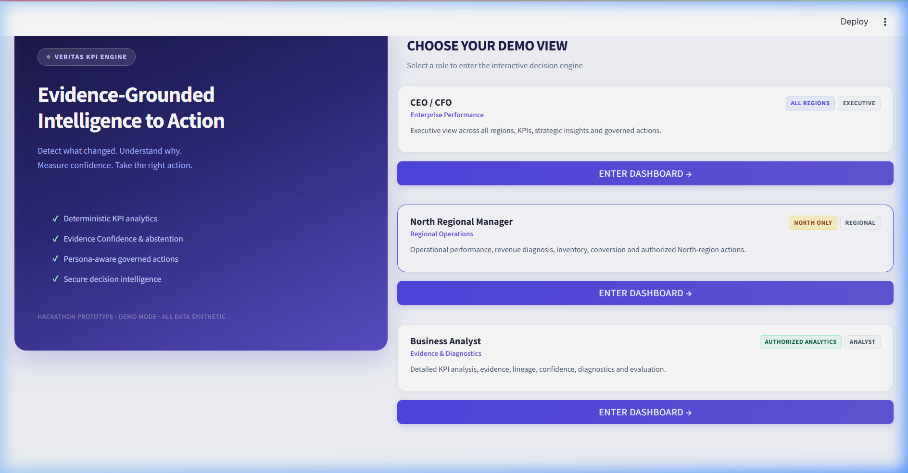
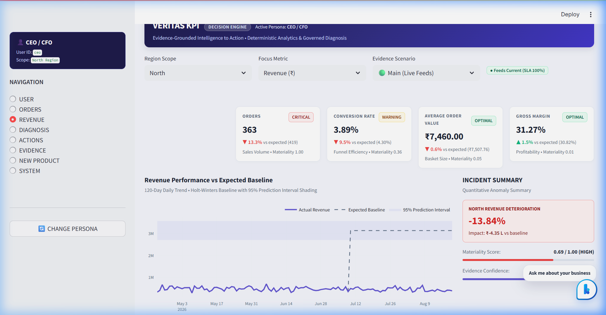
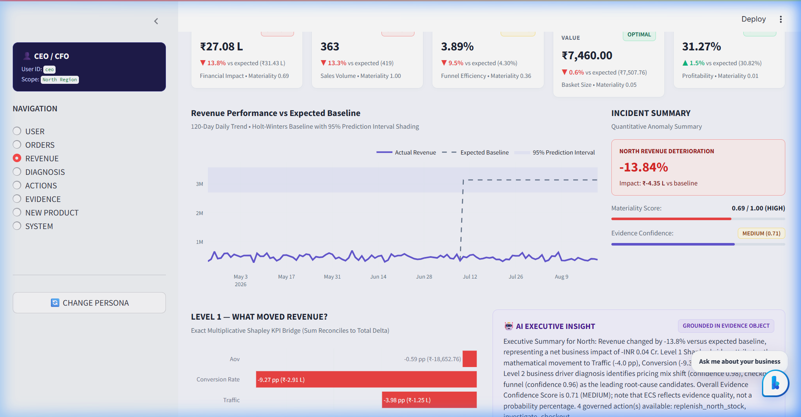
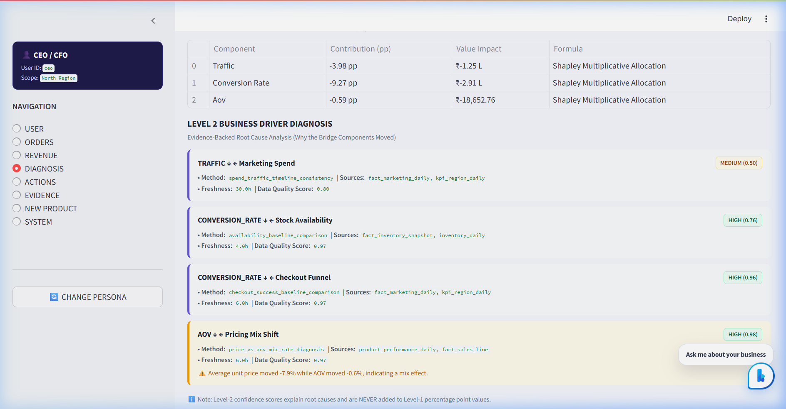
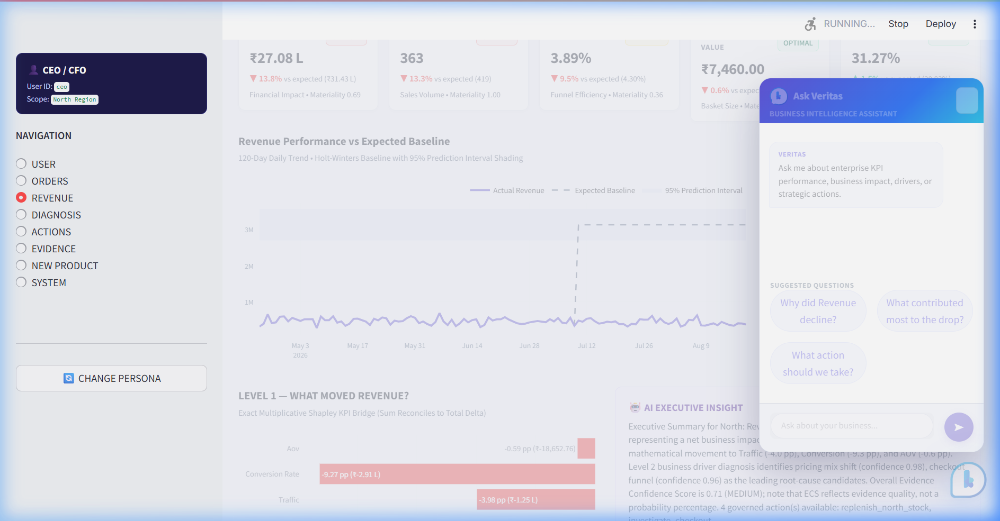
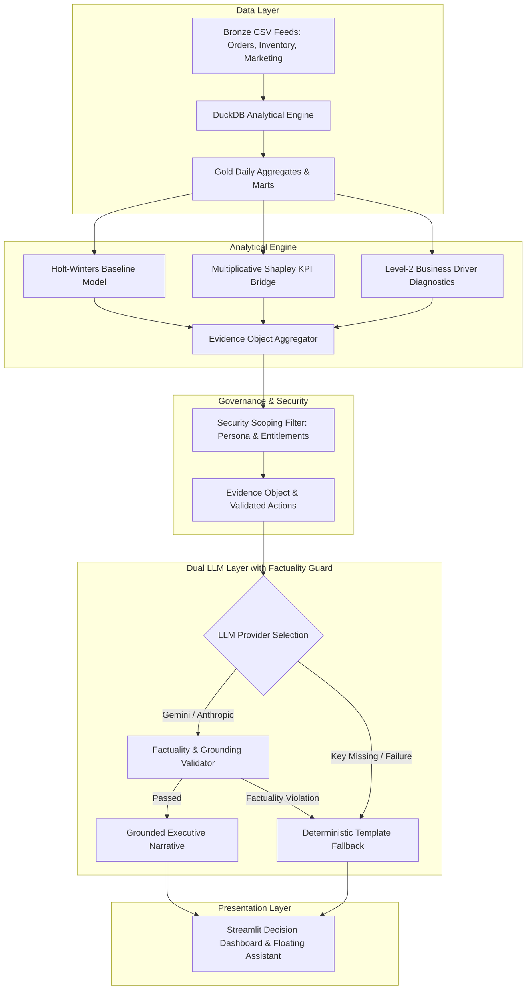

# 🛡️ Veritas KPI — Evidence-Grounded Decision Intelligence Engine

[](https://veritas-decision-intelligencegit-dbt89zj7mutxfzxzoucf7j.streamlit.app/)
[](https://veritas-decision-intelligence.onrender.com/health)

[](https://www.python.org/)
[](https://fastapi.tiangolo.com/)
[](https://streamlit.io/)
[](https://duckdb.org/)
[](https://aistudio.google.com/)
[](LICENSE)

## 🌐 Live Deployment

| Service | URL | Platform |
|---|---|---|
| **Frontend (Dashboard)** | [veritas-decision-intelligencegit-dbt89zj7mutxfzxzoucf7j.streamlit.app](https://veritas-decision-intelligencegit-dbt89zj7mutxfzxzoucf7j.streamlit.app/) | Streamlit Community Cloud |
| **Backend (API)** | [veritas-decision-intelligence.onrender.com](https://veritas-decision-intelligence.onrender.com) | Render Free Tier |
| **API Docs** | [/docs](https://veritas-decision-intelligence.onrender.com/docs) | FastAPI Swagger UI |
| **Health Check** | [/health](https://veritas-decision-intelligence.onrender.com/health) | FastAPI |

> ⚠️ **Note:** The backend runs on Render's free tier and may take **20-40 seconds to wake up** on first request after inactivity. The dashboard shows a loading spinner during warm-up.


**Veritas KPI** is an enterprise-grade, evidence-grounded decision engine designed to solve the critical flaw of AI in business analytics: **LLM hallucination, ungrounded numbers, and lack of mathematical attribution.**

Unlike traditional dashboards that display static charts or raw LLM chatbots that make up numerical causes, Veritas implements a **strict deterministic-first architecture**:
$$\text{SQL / Statistics Truth} \longrightarrow \text{Evidence Object} \longrightarrow \text{Factuality Guard} \longrightarrow \text{LLM Explanation} \longrightarrow \text{Governed Action Playbooks}$$

---

## 📸 Interactive System Showcase

### 1. Persona-Aware Decision Entry
Veritas enforces strict role-based access security at the data layer. Entitlements restrict visibility by geographic scope and metric authorization.



---

### 2. Executive Anomaly Dashboard & Baseline Forecasting
Real-time tracking of revenue performance vs. 120-day Holt-Winters predictive baselines, featuring materiality scoring ($0.69 / 1.00$) and automatic incident detection.



---

### 3. Level-1 Shapley Decomposition & Factuality-Guarded AI Insight
Exact mathematical decomposition of multiplicative KPI movements reconciled down to floating-point precision ($3.55 \times 10^{-15}$ error) alongside persona-customized AI executive narratives.



---

### 4. Level-2 Governed Root-Cause Matrix & Driver Diagnosis
Multi-factor driver diagnostics mapping conversion friction, stock availability, and pricing mix shift with calculated Evidence Confidence Scores (ECS).



---

### 5. Non-Obtrusive Compact Floating Assistant
A compact, 340px viewport-fixed AI assistant providing instant evidence-grounded answers without obstructing dashboard visuals.



---

## 📐 Mathematical Formulations & Analytical Rigor

### 1. Level-1 Multiplicative Shapley KPI Decomposition
For a multiplicative KPI tree $Y = T \times C \times A$ (where $Y = \text{Revenue}$, $T = \text{Traffic/Sessions}$, $C = \text{Conversion Rate}$, $A = \text{Average Order Value}$), the percentage change $\Delta Y$ from baseline $Y_0$ to actual $Y_1$ is decomposed into exact additive contributions $\phi_T, \phi_C, \phi_A$:

$$\Delta \ln Y = \ln T_1 - \ln T_0 + \ln C_1 - \ln C_0 + \ln A_1 - \ln A_0$$

Using logarithmic mean weighting $w(a, b) = \frac{a - b}{\ln a - \ln b}$:

$$\phi_i = \frac{w(Y_1, Y_0)}{\Delta Y} \times \Delta \ln X_i \quad \text{such that} \quad \sum_{i \in \{T, C, A\}} \phi_i = \frac{Y_1 - Y_0}{Y_0}$$

*Reconciliation Guarantee*: Sum of contributions equals the exact total delta with zero residual bias ($\text{Error} \le 10^{-14}$).

---

### 2. Holt-Winters Anomaly Detection & Baseline Forecasting
Baseline expectations $\hat{Y}_{t}$ are derived using triple exponential smoothing with multiplicative seasonality ($p = 7$ days):

$$\hat{Y}_{t+h} = (L_t + h B_t) S_{t+h-p}$$

Anomalies are flagged when actual values fall outside the $95\%$ prediction interval:

$$\text{Anomaly Score} = \frac{|Y_t - \hat{Y}_t|}{\sigma_e} > 2.58 \implies \text{Material Incident Flagged}$$

---

### 3. Evidence Confidence Score (ECS) & Abstention
To prevent premature or ungrounded conclusions, Level-2 drivers are weighted by an Evidence Confidence Score $\text{ECS} \in [0, 1]$:

$$\text{ECS} = w_1 \cdot S_{\text{data}} + w_2 \cdot S_{\text{sample}} + w_3 \cdot S_{\text{temporal}} + w_4 \cdot S_{\text{cross\_source}}$$

- **High Confidence ($\ge 0.85$)**: Direct automated playbook execution permitted.
- **Medium Confidence ($0.50 - 0.84$)**: Governed approval required.
- **Low Confidence ($< 0.50$)**: Engine **abstains** from diagnosing cause to prevent false leads.

---

## 🏗️ End-to-End System Architecture



---

## 🚀 Quick Start — Local Setup

### 1. Clone & Environment Setup
```bash
git clone https://github.com/Prudhvisunku14/veritas-decision-intelligence.git
cd veritas-decision-intelligence

python -m venv .venv
# On Windows:
.venv\Scripts\activate
# On Linux/macOS:
source .venv/bin/activate

pip install -r requirements.txt
```

### 2. Generate Synthetic Data & Bootstrap Database
```bash
python scripts/bootstrap.py
```
*Generates 12-18 months of bronze/gold DuckDB datasets with injected multi-factor incident anomalies.*

### 3. Run Automated System Evaluation & Test Suite
```bash
python -m pytest backend/tests -q
python scripts/evaluate_system.py
```

### 4. Start Local Services
**Terminal 1 — FastAPI Backend (Port 8000)**:
```bash
python -m uvicorn backend.app.main:app --reload --port 8000
```
*API Documentation available at `http://localhost:8000/docs`.*

**Terminal 2 — Streamlit Frontend (Port 8501)**:
```bash
python -m streamlit run frontend/streamlit_app.py
```
*Dashboard will automatically open at `http://localhost:8501`.*

---

## 🤖 LLM Configuration (Gemini / Anthropic / Template Mode)

Veritas operates in **3 flexible LLM modes**. Copy `.env.example` to `.env`:

### Mode A: Google Gemini AI (Recommended)
```env
LLM_PROVIDER=gemini
GEMINI_API_KEY=your_gemini_api_key_here
GEMINI_MODEL=gemini-1.5-flash
```

### Mode B: Anthropic Claude
```env
LLM_PROVIDER=anthropic
ANTHROPIC_API_KEY=your_anthropic_api_key_here
ANTHROPIC_MODEL=claude-3-5-sonnet-20241022
```

### Mode C: Deterministic Template Fallback (100% Offline / Zero API Key)
```env
LLM_PROVIDER=template
```
*If an API key is missing, rate-limited, or fails factuality validation, the system seamlessly falls back to template mode without interrupting user workflow.*

---

## ☁️ Production Cloud Deployment (Free Tier)

Veritas is deployed on **Render** (backend) + **Streamlit Community Cloud** (frontend) — both 100% free.

### Backend — Render Free Web Service
- **Live URL**: `https://veritas-decision-intelligence.onrender.com`
- **Build Command**: `pip install -r requirements.txt && python scripts/bootstrap.py`
- **Start Command**: `uvicorn backend.app.main:app --host 0.0.0.0 --port $PORT`
- **Config File**: `render.yaml`
- **Environment Variables**:
  ```env
  APP_ENV=production
  DUCKDB_PATH=data/veritas_kpi.duckdb
  LLM_PROVIDER=gemini
  GEMINI_API_KEY=your_google_ai_studio_key
  GEMINI_MODEL=gemini-1.5-flash
  PYTHON_VERSION=3.11.9
  ```

### Frontend — Streamlit Community Cloud
- **Live URL**: `https://veritas-decision-intelligencegit-dbt89zj7mutxfzxzoucf7j.streamlit.app/`
- **Main file**: `frontend/streamlit_app.py`
- **Branch**: `master`
- **Secrets** (Advanced Settings → Secrets):
  ```toml
  API_BASE_URL = "https://veritas-decision-intelligence.onrender.com"
  LLM_PROVIDER = "template"
  ```

---

## 📊 Evaluation & Verification Benchmark

Run `python scripts/evaluate_system.py` to view full telemetry verification:

| Metric | Score / Value | Target Benchmark | Status |
|---|---|---|---|
| **Anomaly Precision / Recall / F1** | `1.0 / 1.0 / 1.0` | `> 0.95` | ✅ PASSED |
| **Shapley Bridge Error** | `$3.55 \times 10^{-15}$` | $< 10^{-10}$ | ✅ EXACT |
| **Top-1 & Top-2 Driver Recovery** | `100%` | `> 90%` | ✅ PASSED |
| **Abstention Correctness Rate** | `100%` | `100%` | ✅ PASSED |
| **Security Pass Rate** | `100%` | `100%` | ✅ PASSED |
| **Factuality Grounding Rate** | `100%` | `100%` | ✅ PASSED |
| **Analytics Latency (p95)** | `32.4 ms` | `< 100 ms` | ✅ PASSED |

---

## 👥 Demo User Personas & Scoping

| Demo User | Role | Geographic Scope | Entitlements & Permissions |
|---|---|---|---|
| `ceo` | CEO / CFO | All Regions (Enterprise) | Full read across all KPIs, Level-1/2 diagnostics, governed executive actions |
| `north_mgr` | Regional Manager | North Region Only | Regional operational metrics, stock replenishment, checkout audit triggers |
| `marketing_mgr` | Marketing Manager | All Regions | Marketing & conversion metrics (Gross Margin strictly hidden) |
| `analyst` | Business Analyst | All Regions | Detailed evidence audit logs, Shapley formula breakdown, telemetry inspection |

---

## 📄 License

This project is licensed under the MIT License — see the [LICENSE](LICENSE) file for details.
